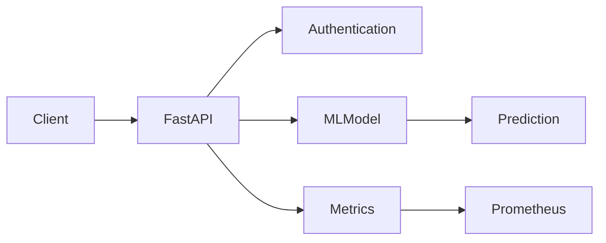

# ML Model API

## Project Overview

ML Model API is a Machine Learning REST API built using FastAPI.

The project serves a trained Iris Random Forest Classification model through REST API endpoints. It includes API versioning, API-key authentication, batch prediction, model information, health monitoring, Prometheus metrics, automated testing, load testing, Docker support, and GitHub Actions CI.

## Architecture



## Technologies Used

* Python
* FastAPI
* Pydantic
* Scikit-learn
* Uvicorn
* Docker
* Docker Compose
* Pytest
* Prometheus
* GitHub Actions

## Machine Learning Model

The project uses the Iris dataset from Scikit-learn.

**Input features:**

* Sepal length
* Sepal width
* Petal length
* Petal width

**Model:** Random Forest Classifier

**Model version:** 1.0

## API Endpoints

| Method | Endpoint                | Purpose               |
| ------ | ----------------------- | --------------------- |
| GET    | `/api/v1/health`        | Health check          |
| GET    | `/api/v1/model-info`    | Model information     |
| POST   | `/api/v1/predict`       | Single prediction     |
| POST   | `/api/v1/predict-batch` | Batch prediction      |
| POST   | `/api/v2/predict`       | Version 2 prediction  |
| GET    | `/metrics`              | Prometheus metrics    |
| GET    | `/docs`                 | Swagger documentation |
| GET    | `/openapi.json`         | OpenAPI specification |

## Authentication

Prediction endpoints use API-key authentication.

The API key is provided using the `X-API-Key` header.

Example:

```text
X-API-Key: YOUR_API_KEY
```

Do not commit the real API key to GitHub.

## API Examples

### 1. Health Check

```bash
curl http://localhost:8000/api/v1/health
```

Example response:

```json
{
  "status": "ok",
  "model_loaded": true
}
```

### 2. Model Information

```bash
curl http://localhost:8000/api/v1/model-info
```

### 3. Single Prediction

```bash
curl -X POST http://localhost:8000/api/v1/predict \
  -H "Content-Type: application/json" \
  -H "X-API-Key: YOUR_API_KEY" \
  -d "{\"features\":[5.1,3.5,1.4,0.2]}"
```

### 4. Batch Prediction

```bash
curl -X POST http://localhost:8000/api/v1/predict-batch \
  -H "Content-Type: application/json" \
  -H "X-API-Key: YOUR_API_KEY" \
  -d "{\"inputs\":[{\"features\":[5.1,3.5,1.4,0.2]},{\"features\":[6.2,3.4,5.4,2.3]}]}"
```

### 5. Version 2 Prediction

```bash
curl -X POST http://localhost:8000/api/v2/predict \
  -H "Content-Type: application/json" \
  -H "X-API-Key: YOUR_API_KEY" \
  -d "{\"features\":[5.1,3.5,1.4,0.2]}"
```

### 6. Prometheus Metrics

```bash
curl http://localhost:8000/metrics
```

### 7. Swagger Documentation

Open in your browser:

```text
http://localhost:8000/docs
```

### 8. OpenAPI Specification

Open in your browser:

```text
http://localhost:8000/openapi.json
```

## Running Locally

Create and activate a virtual environment:

```powershell
python -m venv venv
.\venv\Scripts\Activate.ps1
```

Install dependencies:

```powershell
pip install -r requirements.txt
```

Start the API:

```powershell
uvicorn app.main:app --reload --port 8000
```

The API will be available at:

```text
http://localhost:8000
```

Swagger documentation:

```text
http://localhost:8000/docs
```

## Running with Docker Compose

Build and start the application:

```powershell
docker compose up --build
```

The API will be available at:

```text
http://localhost:8000
```

To stop the application:

```powershell
docker compose down
```

## Testing

Run the complete test suite:

```powershell
pytest -q
```

Latest test result:

```text
12 passed
```

## Load Testing

A basic load test was performed with:

* Total requests: 100
* Successful requests: 100
* Failed requests: 0
* Average response time: approximately 5.49 seconds

## Project Structure

```text
ml-api-project/
│
├── app/
│   ├── main.py
│   ├── v1.py
│   └── v2.py
│
├── tests/
│   ├── test_predict.py
│   ├── test_batch.py
│   ├── test_v2.py
│   └── test_integration.py
│
├── model/
│   └── model.joblib
│
├── .github/
│   └── workflows/
│       └── ci.yml
│
├── Dockerfile
├── docker-compose.yml
├── requirements.txt
├── load_test.py
├── .gitignore
└── README.md
```

## Monitoring

The API exposes Prometheus-compatible metrics through:

```text
GET /metrics
```

These metrics can be used to monitor API requests and application performance.

## What I Learned

Through this project, I learned how to:

* Build REST APIs using FastAPI.
* Deploy a Machine Learning model through an API.
* Implement API-key authentication.
* Create API versioning.
* Implement single and batch predictions.
* Add health checks and model information endpoints.
* Add Prometheus monitoring metrics.
* Write automated tests using Pytest.
* Perform basic load testing.
* Containerize an application using Docker.
* Run services using Docker Compose.
* Set up continuous integration using GitHub Actions.
* Organize a production-style ML API project.

## Independent Extension

**GitHub Actions CI**

A GitHub Actions workflow was added to automatically run the project's test suite whenever code is pushed to the repository.

This helps identify test failures early and improves the reliability of the development workflow.

## Project Completion

The ML Model API was tested locally and through Docker Compose.

The project includes:

* FastAPI REST API
* Machine Learning model serving
* API authentication
* API versioning
* Batch prediction
* Health monitoring
* Prometheus metrics
* Automated testing
* Load testing
* Docker containerization
* Docker Compose support
* GitHub Actions CI

## Author

**Jayalakshmi N**
